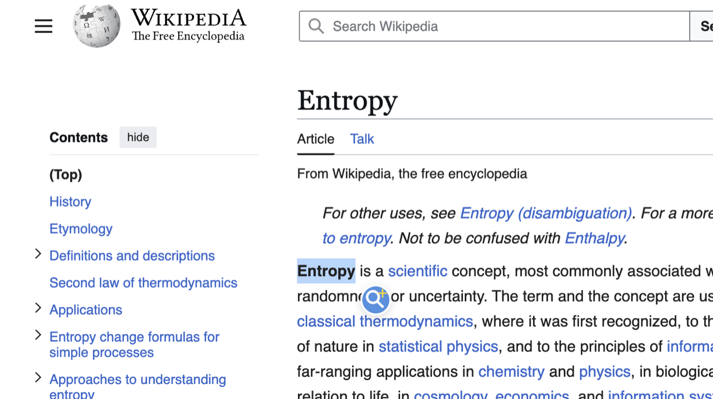
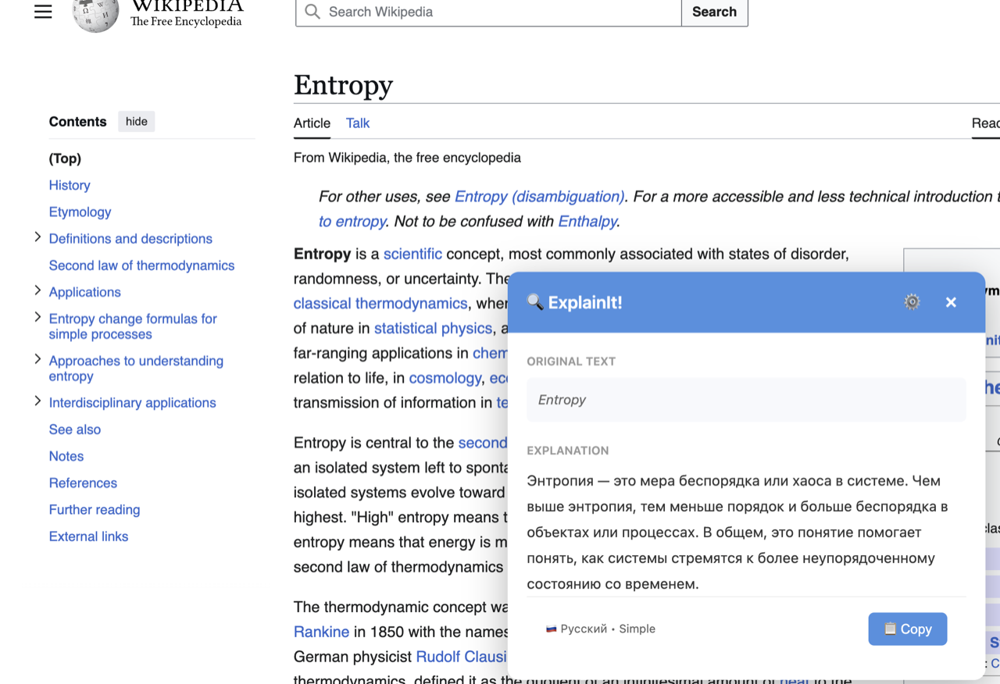

# 🔍 ExplainIt! - AI-Powered Text Explanation Chrome Extension

> Instant AI explanations for any selected text. One click, instant result!

## 🎯 What is ExplainIt?

ExplainIt! is a Chrome Extension that explains any text you select on a webpage using AI (OpenAI GPT-4o-mini). Simply highlight text, click the icon, and get an instant explanation in your preferred language and complexity level.

## ✨ Features

### 🚀 One-Click Explanations
- Select text (3-2000 characters)
- Click the floating icon
- Get instant AI-powered explanation in a beautiful popup

### 🌍 Multi-Language Support
- **English** 🇬🇧
- **Russian** 🇷🇺

### 🎯 Three Complexity Levels
- **Simple Words** - Easy to understand for everyone
- **Like I'm 5** - Explained as if to a child
- **Expert Level** - Technical and precise

### 💎 Beautiful UX
- Inline popup (no need to click toolbar!)
- Loading animation
- Shadow DOM (no style conflicts)
- Copy to clipboard
- Close on ESC or click outside
- Settings sync across devices

## 🏗️ Architecture

```
┌─────────────────┐
│  Content Script │  ← Detects text selection, shows icon
└────────┬────────┘
         │
         ↓
┌─────────────────┐
│ Inline Popup    │  ← Beautiful modal on page
└────────┬────────┘
         │
         ↓
┌─────────────────┐
│ Background SW   │  ← Routes API calls (CORS bypass)
└────────┬────────┘
         │
         ↓
┌─────────────────┐
│  Backend API    │  ← Node.js + Express
└────────┬────────┘
         │
         ↓
┌─────────────────┐
│   OpenAI API    │  ← GPT-4o-mini
└─────────────────┘
```

## 🚀 Local Development Setup

### Prerequisites
- Node.js 18+
- Chrome Browser
- OpenAI API Key

### Backend Setup

1. **Navigate to backend folder:**
```bash
cd backend
```

2. **Install dependencies:**
```bash
npm install
```

3. **Create `.env` file:**
```bash
cp .env.example .env
```

4. **Add your OpenAI API key to `.env`:**
```env
OPENAI_API_KEY=sk-proj-your-key-here
PORT=3000
NODE_ENV=development
```

5. **Start the backend:**
```bash
npm start
```

Backend will run on `http://localhost:3000`

### Extension Setup

1. **Open Chrome and navigate to:**
```
chrome://extensions/
```

2. **Enable "Developer mode"** (top right toggle)

3. **Click "Load unpacked"**

4. **Select the `/extension` folder** from this project

5. **Pin the extension** (click puzzle icon 🧩 in toolbar → pin ExplainIt!)

### Testing

1. Open any webpage
2. Select some text (at least 3 characters)
3. Click the blue ExplainIt! icon that appears
4. See the explanation in the popup!

## 🎨 Tech Stack

### Frontend (Extension)
- **Vanilla JavaScript** (no frameworks!)
- **Manifest V3** (latest Chrome Extension API)
- **Shadow DOM** (style isolation)
- **Chrome Storage API** (settings sync)

### Backend
- **Node.js** + **Express**
- **OpenAI SDK** (gpt-4o-mini)
- **express-validator** (request validation)
- **express-rate-limit** (abuse prevention)
- **CORS** enabled for extensions

## 💰 Cost Estimate

Using **gpt-4o-mini** (cheapest OpenAI model):
- **Input:** $0.150 / 1M tokens
- **Output:** $0.600 / 1M tokens

**Average explanation:**
- ~200 input tokens + ~150 output tokens
- **Cost per request:** ~$0.0001 (0.01 cent)
- **$1 = ~8,000 explanations!** 💸

## 🔒 Security

- ✅ API key stored only on backend (never in extension)
- ✅ HTTPS traffic only
- ✅ Rate limiting (10 req/min in production)
- ✅ Request validation
- ✅ XSS sanitization
- ✅ Shadow DOM isolation

## 📸 Screenshots

| Select Text | Get Explanation | Settings |
|-------------|-----------------|----------|
|  |  |  |

## 🔐 Privacy

Your privacy matters. We do NOT collect browsing history, personal data, or analytics. Only the text you explicitly select is processed. See our [Privacy Policy](https://dimagious.github.io/ExplainIt/privacy-policy.html).

## 🎯 Roadmap

### v1.0.0 - MVP ✅
- [x] Text selection and floating icon
- [x] AI-powered explanations (OpenAI GPT-4o-mini)
- [x] Multi-language support (EN/RU)
- [x] Three complexity levels
- [x] Professional icons (magnifying glass with sparkle)
- [x] Privacy policy
- [x] Chrome Web Store submission assets

### v1.1 - Enhanced UX
- [ ] Better error messages with suggestions
- [ ] Keyboard shortcuts
- [ ] More languages

### v2.0 - Monetization
- [ ] User authentication
- [ ] Subscription plans
- [ ] Usage analytics

## 📜 License

MIT License - See LICENSE file for details

---

## 🎉 MVP Status: DELIVERED ✅

**Release:** v1.0.0-mvp  
**Date:** November 25, 2025  
**Status:** Fully functional, tested, ready for use!

### What Works:
✅ Text selection detection  
✅ Floating icon with positioning  
✅ Inline popup with beautiful UI  
✅ OpenAI integration (3 tones × 2 languages)  
✅ Settings persistence  
✅ Copy to clipboard  
✅ Error handling  
✅ Rate limiting  
✅ CORS bypass via background script  

### User Flow:
1. 👆 Select text
2. 🖱️ Click icon  
3. 🔍 **INSTANT RESULT!**
