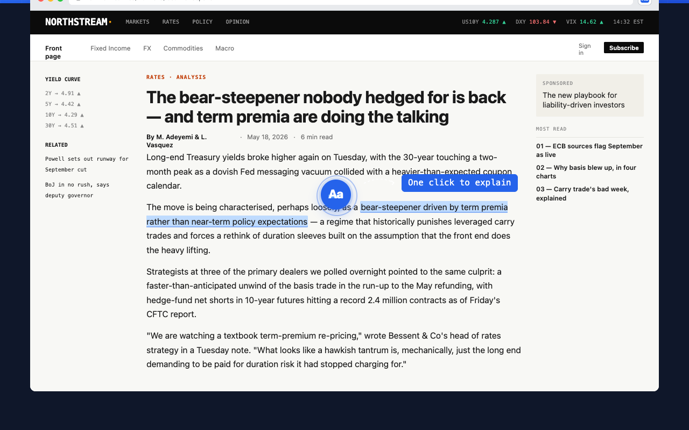
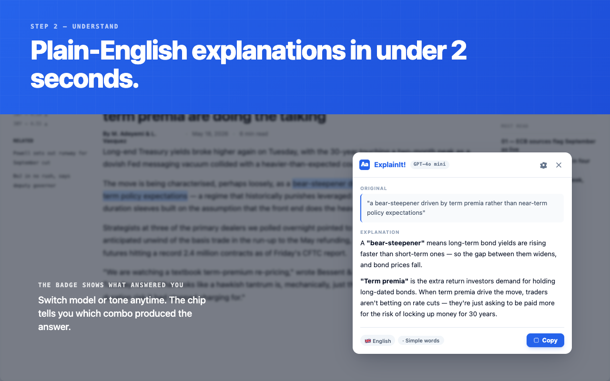
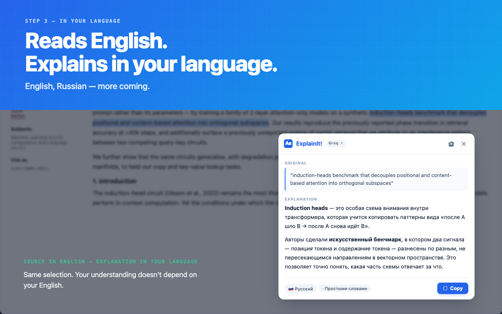
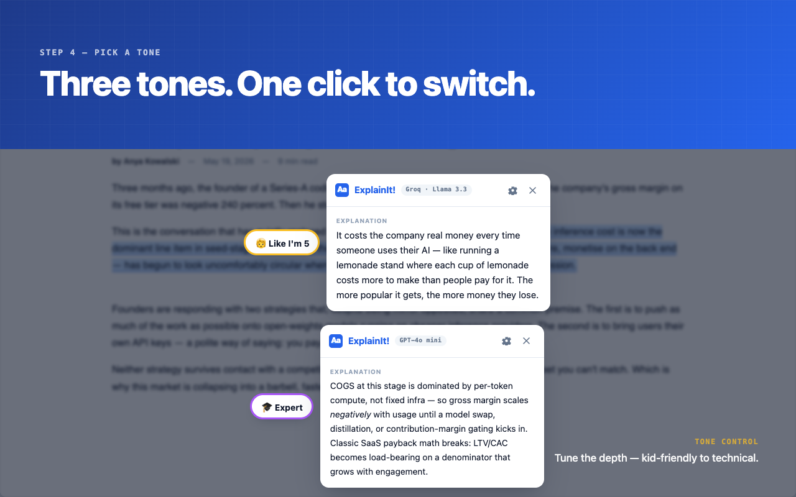
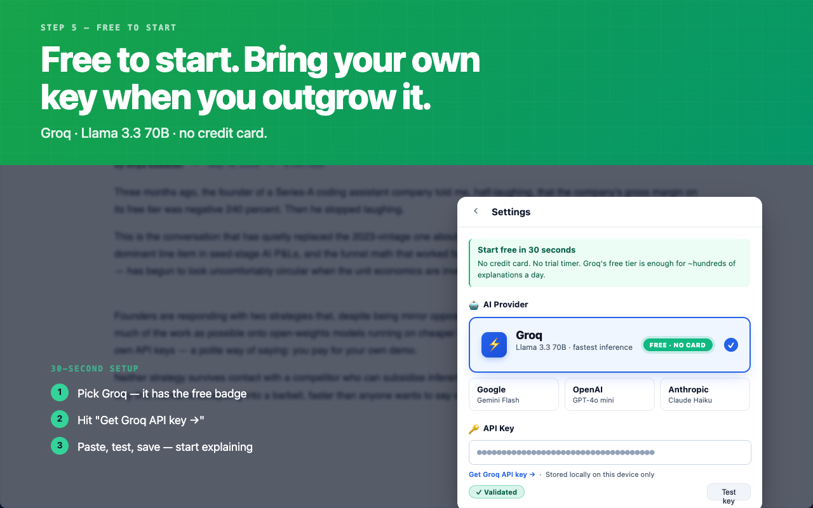

<div align="center">


# ExplainIt!

### Read English content in your own language.

Highlight any sentence on the web. Click once. Get a plain-English (or plain-Russian) explanation right next to your selection — in seconds, without leaving the page.

<a href="https://chromewebstore.google.com/detail/explainit/hpohkpfddcgchmapdnncddilkgiobabb">
  
</a>
&nbsp;

&nbsp;


<br/><br/>

<!--
  Hero: showing the static "Highlight. Click. Understand." composition.
  Swap to docs/marketing/hero.gif once the animated GIF is captured —
  see docs/marketing/hero-animation/README.md for the recording steps.
-->


</div>

---

## Why this exists

Half the web assumes context most readers don't have. Legal contracts, academic papers, dense news analyses, Stack Overflow answers — all written for people who already know the topic.

Three things you might do today:

- **Copy → switch to ChatGPT → paste → wait → switch back.** Lost the page. Lost the flow.
- **Pay $9–25 / month** for an AI sidebar (Monica, Sider, MaxAI) that takes over your screen.
- **Skip the hard sentence** and hope it wasn't important.

ExplainIt is a fourth option: **select a sentence, click once, read the explanation right where you read.** In English or Russian. Free, with Groq.

---

## See it in action

<table>
  <tr>
    <td width="50%" align="center">
      
      <br/>
      <sub><b>Dense → plain.</b> Bloomberg, arXiv, Stack Overflow.</sub>
    </td>
    <td width="50%" align="center">
      
      <br/>
      <sub><b>English source → Russian explanation.</b> One click, same page.</sub>
    </td>
  </tr>
  <tr>
    <td width="50%" align="center">
      
      <br/>
      <sub><b>Three depths.</b> Simple · Like I'm 5 · Expert. Switch in one click.</sub>
    </td>
    <td width="50%" align="center">
      
      <br/>
      <sub><b>Free to start.</b> Bring your own key when you outgrow it.</sub>
    </td>
  </tr>
</table>

---

## What you get

- 🆓 **Free tier with Groq** — no credit card, no signup beyond the key
- 🌍 **Explains in your language** — English & Russian today, 10+ more in 2.1.0 ([roadmap](#roadmap))
- 🎯 **Three tones** — *Simple* · *Like I'm 5* · *Expert* — same idea, different depth
- ⚡ **Fast** — under 2 seconds per explanation with Groq's Llama 3.3 70B
- 🔒 **Privacy by design** — your API key never leaves your device
- 🤖 **Bring any provider** — Groq, Google Gemini, OpenAI, or Anthropic Claude
- 🪶 **No sidebar takeover** — popup appears next to your selection, dismisses when you click away

---

## How it works

1. **Highlight** any text on any webpage
2. **Click** the floating ExplainIt bubble that appears next to your selection
3. **Read** the explanation in a popup, right there in context — copy, retry, or change tone with one click

No tabs to switch. No paste. No interrupting your reading flow.

---

## Get started in 30 seconds

1. **Install** the extension from the [Chrome Web Store](https://chromewebstore.google.com/detail/explainit/hpohkpfddcgchmapdnncddilkgiobabb)
2. **Click the toolbar icon.** The popup will show *"One key, then you're explaining"* with a `Get free key →` button
3. **Open Groq** (the button does it for you), sign up (no credit card), copy your API key
4. **Paste** the key in ExplainIt's Settings, click *Test key*, then *Save*
5. **Select text on any page.** That's it.

---

## Providers & cost

ExplainIt is BYOK — Bring Your Own Key. Pick the provider that fits you, switch any time.

| Provider | Cost | Speed | Why pick it |
|---|---|---|---|
| **🥇 Groq · Llama 3.3 70B** | **Free**, no card | Fastest (≈ 1–2 s) | Default for new users |
| 🇬🇧 Google · Gemini 1.5 Flash | ~$0.0001 per explanation | Fast | Already in Google ecosystem |
| 🤖 OpenAI · GPT-4o mini | ~$0.0002 per explanation | Fast | Already have an OpenAI key |
| 🧠 Anthropic · Claude 3.5 Haiku | ~$0.0003 per explanation | Fast | Most nuanced output |

Costs above are based on each provider's published per-token pricing × the size of a typical explanation request. Your actual usage will vary, but expect cents-per-month for personal use.

---

## Languages

Available today:

🇬🇧 **English** · 🇷🇺 **Русский**

Shipping in 2.1.0:

🇪🇸 Español · 🇨🇳 中文 · 🇩🇪 Deutsch · 🇫🇷 Français · 🇵🇹 Português · 🇯🇵 日本語 · 🇰🇷 한국어 · 🇮🇳 हिन्दी · 🇸🇦 العربية · 🇹🇷 Türkçe · 🇻🇳 Tiếng Việt

Languages get added as we validate the AI output quality for each — we'd rather ship fewer languages well than 30 languages with shaky Hindi.

---

## Privacy

- Your **API key never leaves your device.** It lives only in `chrome.storage.local`, which is never synced to Google or anywhere else.
- The **selected text** you highlight is sent **only** to the provider you picked. Nothing routes through any ExplainIt server, because there is no ExplainIt server.
- **No browsing history collection.** No analytics. No telemetry. No signup. No email. No account.
- The full policy lives in [`privacy-policy.html`](privacy-policy.html).

---

## Roadmap

- ✅ **2.0.2 (current)** — Free Groq default · optional host permissions · branched empty-state · typed error UI · new visual identity
- 🔜 **2.1.0** — Multi-language output: 12+ languages
- 🔮 **2.2.0** — Saved explanations history · vocab notebook · per-page learning streaks

---

## For developers

<details>
<summary><b>Architecture, local setup, testing, contributing</b></summary>

<br/>

### Architecture

```text
Page Selection
   ↓
Content Script + Inline Popup UI
   ↓
Background Service Worker
   ↓
Selected AI Provider API (Groq / Gemini / OpenAI / Anthropic)
```

No dedicated server is required for extension runtime. Provider hosts are requested **at runtime** (when the user picks a provider and clicks *Test key*), not at install time.

### Local setup

```bash
git clone <this-repo>
cd extension
npm ci
```

Then in Chrome: `chrome://extensions/` → enable *Developer mode* → *Load unpacked* → select the `extension/` folder.

### Run tests

```bash
cd extension
npm test
```

132 Jest tests covering provider call shapes, retry logic, error classification, key-prefix validation, storage routing, and the setupCompleted flag.

### Storage model

`chrome.storage.local` (per-install, never synced):

- `provider` — chosen provider id
- `apiKeys` — per-provider key map: `{ groq: '...', openai: '...', ... }`
- `setupCompleted` — sticky boolean, true after first successful save with a key

`chrome.storage.sync` (cross-device preferences):

- `language` · `tone`

### Manifest permissions

- `permissions: ["storage"]` — silent at install time
- `optional_host_permissions` for the 4 provider APIs — requested at runtime when the user picks a provider, NOT at install
- Content scripts on `<all_urls>` — required to detect text selection on any page

### Key files

- [`extension/manifest.json`](extension/manifest.json) — MV3 manifest
- [`extension/popup.html`](extension/popup.html), [`popup.js`](extension/popup.js), [`popup.css`](extension/popup.css) — toolbar popup
- [`extension/background.js`](extension/background.js) — service worker, provider dispatch, `classifyError` for typed UI copy
- [`extension/content.js`](extension/content.js), [`inline-popup.js`](extension/inline-popup.js) — in-page floating bubble
- [`extension/config.js`](extension/config.js) — provider metadata, prompt templates
- [`extension/tests/`](extension/tests/) — Jest unit tests

### Repository structure

```
extension/        — active product code
extension/tests/  — Jest unit tests
store-assets/     — Chrome Web Store text, shot list, promo brief, dashboard checklist
docs/marketing/   — README assets (GIF, screenshots)
privacy-policy.html
```

### Contributing

Open an issue first for anything bigger than a typo. PRs that touch the popup or provider code should include tests — see `extension/tests/popup.test.js` for the patterns.

</details>

---

## License

[MIT](LICENSE) — use it, fork it, ship it.
